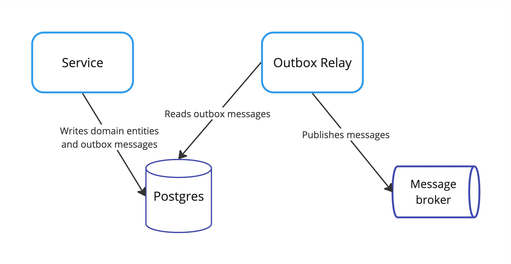
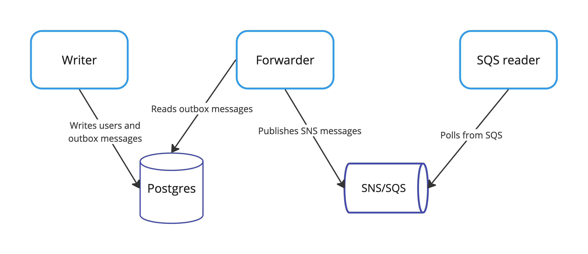

[](https://goreportcard.com/report/github.com/nikolayk812/pgx-outbox)
[](https://pkg.go.dev/github.com/nikolayk812/pgx-outbox)

[](https://coveralls.io/github/nikolayk812/pgx-outbox)
[](https://github.com/nikolayk812/pgx-outbox/network/updates)
[](https://go.dev/)
[](https://github.com/nikolayk812/pgx-outbox/releases)


# pgx-outbox

This is a simple Golang implementation for [transactional outbox](https://microservices.io/patterns/data/transactional-outbox.html) pattern to solve [dual writes](https://docs.aws.amazon.com/prescriptive-guidance/latest/cloud-design-patterns/transactional-outbox.html) problem for PostgreSQL using [jackc/pgx](https://github.com/jackc/pgx) driver.

More advanced options are described in [Revisiting the Outbox Pattern](https://www.decodable.co/blog/revisiting-the-outbox-pattern) article by [Gunnar Morling](https://github.com/gunnarmorling).

Motivation behind this library is to provide a generic extensible implementation to avoid boilerplate code in projects.

Note: this is not a general-purpose Postgres queue, even though internal implementation is based on a table with a queue-like structure.



## How to use

### 1. Add database migration to a project:

```sql
CREATE TABLE IF NOT EXISTS outbox_messages
(
    id           BIGINT PRIMARY KEY GENERATED ALWAYS AS IDENTITY,

    broker       TEXT                                NOT NULL,
    topic        TEXT                                NOT NULL,
    metadata     JSONB,
    payload      JSONB                               NOT NULL,

    created_at   TIMESTAMP DEFAULT CURRENT_TIMESTAMP NOT NULL,
    published_at TIMESTAMP
);

CREATE INDEX IF NOT EXISTS idx_outbox_messages_published_at_null ON outbox_messages (published_at) WHERE published_at IS NULL;
```

The outbox table name can be customized, but the table structure should remain exactly the same.

### 2. Add outbox.Writer to repository layer:

```go
type repo struct {
	pool *pgxpool.Pool
	
	writer outbox.Writer
	messageMapper types.ToMessageFunc[User]
}
```

To map your a domain model, i.e. `User` to the outbox message, implement the `types.ToMessageFunc` function is service layer and pass it to the repository either in `New` function or as a repository method parameter.

Start using the `writer.Write` method in the repository methods which should produce outbox messages.

```go
func (r *repo) CreateUser(ctx context.Context, user User) (u User, txErr error) {
	// create a transaction, commit/rollback in defer() depending on txErr

	// INSERT INTO users table under-the-hood
	user, err = r.createUser(ctx, tx, user)
	if err != nil {
		return u, fmt.Errorf("createUser: %w", err)
	}
	
	message, err := r.messageMapper(user)
	if err != nil {
		return u, fmt.Errorf("messageMapper: %w", err)
	}

	// INSERT INTO outbox_messages table under-the-hood
	if _, err := r.writer.Write(ctx, tx, message); err != nil {
		return u, fmt.Errorf("writer.Write: %w", err)
	}

	return user, nil
}
```

See `outbox.Writer` example in [repo.go](./examples/01_sns/writer/repo.go) of the `01_sns` directory.


### 3. Add outbox.Forwarder to a cronjob:

```go
forwarder, err := outbox.NewForwarderFromPool("outbox_messages", pool, publisher)

stats, err := forwarder.Forward(ctx, 10)
slog.Info("forwarded", "stats", stats)
```

where `pool` is a `pgxpool.Pool` and `publisher` is an implementation of `outbox.Publisher`.

This library provides reference publisher implementation for AWS SNS publisher in the `sns` module.

```go
publisher, err := outboxSns.NewPublisher(awsSnsCli, messageTransformer{})
```

where `messageTransformer` is an implementation of `outboxSns.MessageTransformer` interface, for example:

```go
func (mt messageTransformer) Transform(message types.Message) (*awsSns.PublishInput, error) {
	topicARN := fmt.Sprintf("arn:aws:sns:%s:%s:%s", tc.region, tc.accountID, message.Topic)

	return &awsSns.PublishInput{
		Message:  aws.String(string(message.Payload)),
		TopicArn: &topicARN,
	}, nil
}
```

See `outbox.Forwarder` example in [main.go](./examples/01_sns/forwarder/main.go) of the `01_sns` directory.


## Examples

### 1. SNS

Source code and instructions for the example are located in the [examples/01_sns](examples/01_sns/README.md) directory.




## Stargazers over time

[](https://starchart.cc/nikolayk812/pgx-outbox)

## Alternatives

- [watermill-sql](https://github.com/ThreeDotsLabs/watermill-sql) - PostgreSQL Pub/Sub for Watermill
- [dataddo/pgq](https://github.com/dataddo/pgq) - Go queue implementation using PostgreSQL
- [Trendyol/go-pq-cdc](https://github.com/Trendyol/go-pq-cdc) - Change Data Capture (CDC) library for PostgreSQL

## Selected resources

- [Revisiting the Outbox Pattern](https://www.decodable.co/blog/revisiting-the-outbox-pattern)
- [Writing a Postgres Logical Replication System in Golang](https://www.dolthub.com/blog/2024-03-08-postgres-logical-replication/)
- [Overcoming Pitfalls of Postgres Logical Decoding](https://blog.peerdb.io/overcoming-pitfalls-of-postgres-logical-decoding)