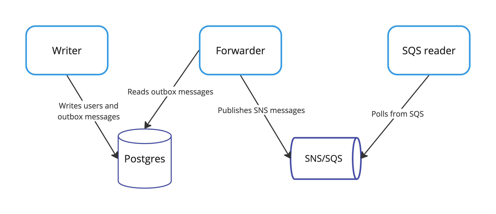

# Postgres to SNS outbox pattern example




### Terminals

Open several terminal windows and navigate to the `examples/01_sns` directory.

```sh
cd examples/01_sns
```

### Docker containers

This example uses two docker containers: `postgres` and `localstack`.
They expose standard ports 5432 for Postgres and 4566 for Localstack.
Initial pulling of the images may take some time.

```sh
docker-compose up -d    
```

<details>
  <summary>without docker-compose</summary>

```sh
docker run -d --name postgres -e POSTGRES_USER=user -e POSTGRES_PASSWORD=password -e POSTGRES_DB=dbname -p 5432:5432 -v $(pwd)/../../internal/sql/01_outbox_messages.up.sql:/docker-entrypoint-initdb.d/01_outbox_messages.up.sql -v $(pwd)/../../internal/sql/02_users.up.sql:/docker-entrypoint-initdb.d/02_users.up.sql postgres:17.2-alpine
```

```sh
docker run -d --name localstack -e SERVICES=sns,sqs -e GATEWAY_LISTEN=0.0.0.0:4566 -e AWS_DEFAULT_REGION=eu-central-1 -p 4566:4566 localstack/localstack:4.0.3
```

</details>


Then using `docker ps` you should see something like this:

```sh
CONTAINER ID   IMAGE                         COMMAND                  CREATED          STATUS                   PORTS                                                                NAMES
fa956368c4d6   localstack/localstack:4.0.3   "docker-entrypoint.sh"   2 minutes ago   Up 2 minutes (healthy)   4510-4559/tcp, 5678/tcp, 0.0.0.0:4566->4566/tcp, :::4566->4566/tcp   localstack
92d28e5e57af   postgres:17.2-alpine          "docker-entrypoint.s…"   2 minutes ago   Up 2 minutes             0.0.0.0:5432->5432/tcp, :::5432->5432/tcp                            postgres
```

### Writer service

This service will write create fake users and write messages to the outbox table.

```sh
go run ./writer
```

Then you should see similar logs in the terminal:

```text
2024/12/25 21:19:37 INFO user created user="[name=Ilene Eichmann, age=93, id=4ace86a2-7384-48ec-93b1-4301971942aa, created=2024-12-25 19:19:37]"
2024/12/25 21:19:39 INFO user created user="[name=Maximillian Greenfelder, age=34, id=e1d41cec-42f3-4615-8ab5-58e61132cb53, created=2024-12-25 19:19:39]"
```

### Forwarder service

This service will forward messages from the outbox table to the SNS topic.
It is responsible to create the SNS topic in the Localstack container.

Rut it from another terminal window in the same directory: `examples/01_sns`

```sh
go run ./forwarder
```

Then you should see similar logs in the terminal:

```text
2024/12/25 20:33:05 INFO forward stats stats="[read: 3, published: 3, acked: 3]"
2024/12/25 20:33:10 INFO forward stats stats="[read: 4, published: 4, acked: 4]"
```

### SQS reader service

This service will create a SQS queue, subscribe it to the SNS topic and read messages from the queue.

Rut it from another terminal window in the same directory: `examples/01_sns`

```sh
go run ./sqs_reader
```

### Cleanup

After running the example, you can stop and remove the containers.

```sh
docker-compose down -v
```