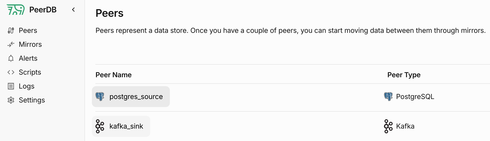
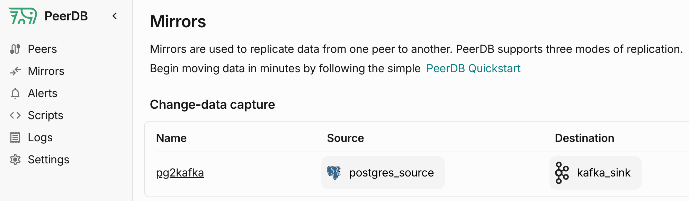
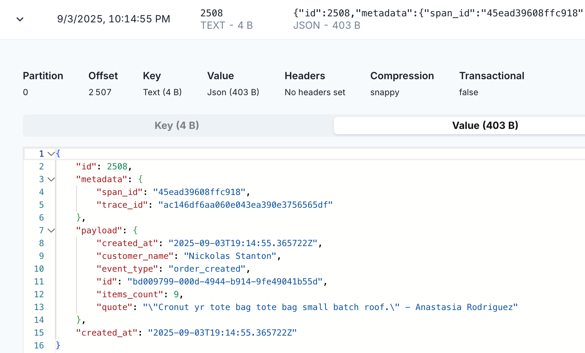

# Postgres to Kafka using PeerDB

##  Architecture

`Writer` service from `../01_sns` produces messages to the outbox table in Postgres.

PeerDB acts as an Outbox Relay, extracts outbox messages using CDC and forwards them to a Kafka topic.

Postgres and PeerDB are started in (Docker) containers using `docker-compose`. 

### Writer

Creates fake orders and persists them in the `orders` table in the Postgres database. 
In the same transaction, it writes messages to the `outbox_messages` table.

In the real world, the `Writer` could be a business service: `order-service`.

### Kafka

This example runs Confluent Kafka in a Docker container using `docker-compose`. 

There is also Redpanda UI available.

### PeerDB

Extracts messages from the `outbox_messages` table in Postgres and forwards them to a Kafka topic.

## Steps to run

### PeerDB

Check out PeerDB from GitHub repo and run the following script:

```sh
./run-peerdb.sh
```
You can find the script [here](https://github.com/PeerDB-io/peerdb/blob/main/run-peerdb.sh).

### Postgres and Kafka

in the `examples/04_peerdb` directory run:

```sh
docker-compose up -d    
```

It will start Postgres, Kafka and Redpanda UI containers and attach them to the same Docker network as PeerDB.


### PeerDB configuration

Access PeerDB UI at [http://localhost:3000](http://localhost:3000/)

#### Postgres Peer
Create Postgres Peer using details from `docker-compose.yml`:
https://docs.peerdb.io/quickstart/quickstart


#### Kafka Peer
Create Kafka Peer using data from `docker-compose.yml`:
https://docs.peerdb.io/quickstart/streams-quickstart
`kafka:29092` for Servers field.



#### Mirror
Create a Mirror to sync data from Postgres Peer to Kafka Peer:

- Mirror type: CDC
- Source: Postgres Peer
- Destination: Kafka Peer
- Sync Interval can be customized.
- Publication Name can be customized.
- Select tables to sync: public.outbox_messages, fields can be customized.
- Target Table: Kafka topic name, can be customized.



### Writer

Navigate to the `examples/01_sns` directory.

```sh
cd ../examples/01_sns
```

Start the writer service:

```sh
go run ./writer
```

### Verification

Check the mirror logs and Sync Status tab in PeerDB UI. You should see messages being synced from Postgres to Kafka.

Access RedPanda UI at [http://localhost:8080/topics](http://localhost:8080/topics)

The screenshot below assumes that script from `scripts/script3.lua` is created and applied to created mirror.



